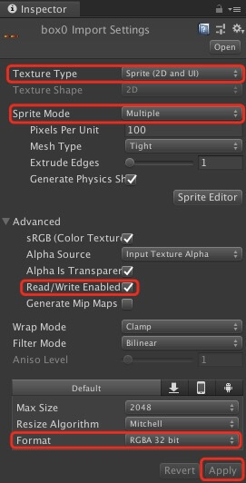
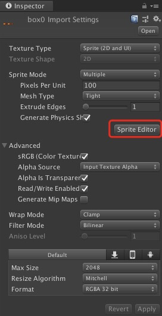
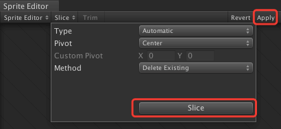
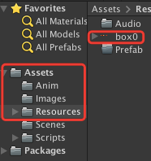
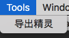
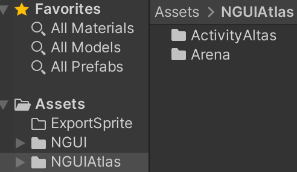
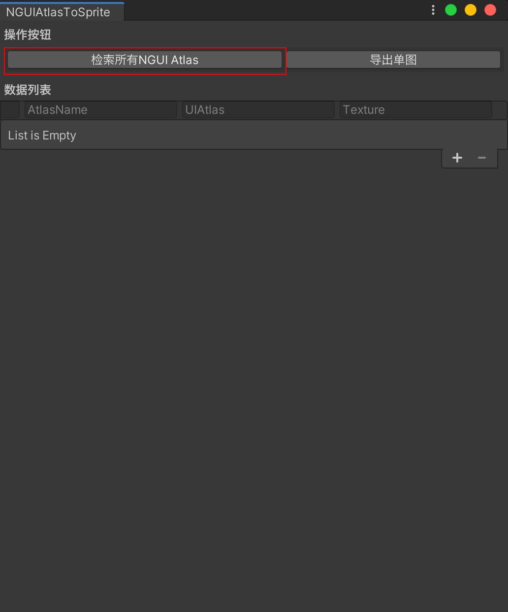
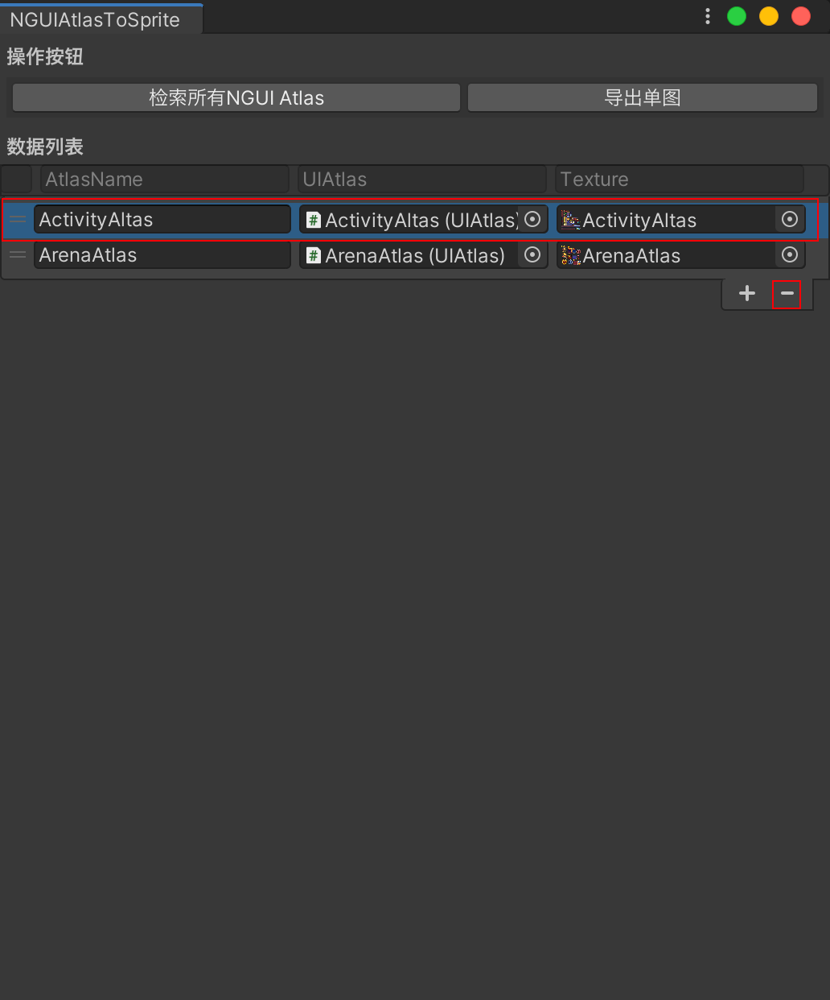
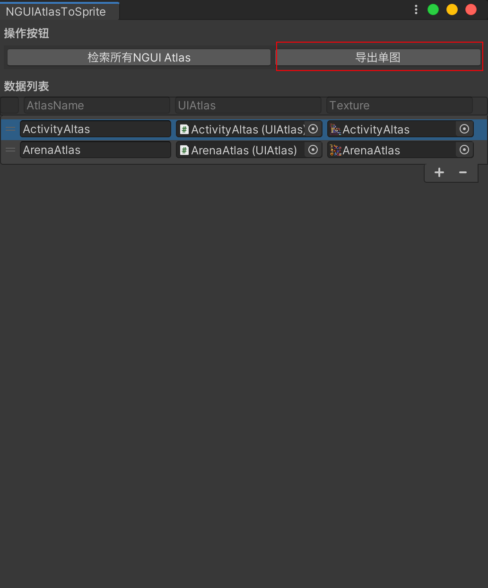
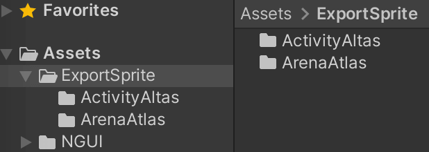

# UnityExportSprite

## 图集图片导出单图

### 介绍

- 将Unity图集切片的精灵导出来

### 使用指导
- 将图集图片（png、tga）放入Unity的“Assets/Resources”目录下，选中图集，在Inspector面板做如下操作：

1. 将Texture Type改成Sprite(2D and UI)

2. 将Sprite Mode改成Multiple

3. 将Read/Write Enabled

4. 将Format改成RGBA 32bit

5. 点击Apply

- 操作如下图



- 点击Sprite Editor，进入精灵编辑器，如下图：



- 进入精灵编辑器后，点击编辑器左上角的Slice，然后在弹出的下拉框中点击Slice，最后点击右上角的Apply，完成对图集切图。



- 完成对图集的切图后，创建C#脚本ExportSpriteEditor.cs文件并添加如下代码：

```c#
using UnityEngine;
using UnityEditor;

/// <summary>
/// 导出精灵工具
/// </summary>
public class ExportSpriteEditor
{
    [MenuItem("Tools/导出精灵")]
    static void ExportSprite()
    {
        string resourcesPath = "Assets/Resources/";
        foreach (Object obj in Selection.objects)
        {
            string selectionPath = AssetDatabase.GetAssetPath(obj);
            if (selectionPath.StartsWith(resourcesPath))
            {
                string selectionExt = System.IO.Path.GetExtension(selectionPath);
                if (selectionExt.Length == 0)
                {
                    Debug.LogError($"资源{selectionPath}的扩展名不对，请选择图片资源");
                    continue;
                }
                // 如果selectionPath = "Assets/Resources/UI/Common.png"
                // 那么loadPath = "UI/Common"
                string loadPath = selectionPath.Remove(selectionPath.Length - selectionExt.Length);
                loadPath = loadPath.Substring(resourcesPath.Length);
                // 加载此文件下的所有资源
                Sprite[] sprites = Resources.LoadAll<Sprite>(loadPath);
                if (sprites.Length > 0)
                {
                    // 创建导出目录
                    string exportPath = Application.dataPath + "/ExportSprite/" + loadPath;
                    System.IO.Directory.CreateDirectory(exportPath);

                    foreach (Sprite sprite in sprites)
                    {
                        Texture2D tex = new Texture2D((int) sprite.rect.width, (int) sprite.rect.height,
                            sprite.texture.format, false);
                        tex.SetPixels(sprite.texture.GetPixels((int) sprite.rect.xMin, (int) sprite.rect.yMin,
                            (int) sprite.rect.width, (int) sprite.rect.height));
                        tex.Apply();

                        // 将图片数据写入文件
                        System.IO.File.WriteAllBytes(exportPath + "/" + sprite.name + ".png", tex.EncodeToPNG());
                    }
                    Debug.Log("导出精灵到" + exportPath);
                }
                Debug.Log("导出精灵完成");
                // 刷新资源
                AssetDatabase.Refresh();
            }
            else
            {
                Debug.LogError($"请将资源放在{resourcesPath}目录下");
            }
        }
    }
}
```
- 代码创建完毕，选中图集图片文件，如下图：



- 点击Unity顶部的菜单栏，选中Tools，点击“导出精灵”，如下图：



- 在Assets/ExportSprite目录下就可以找到导出的切图文件了。如下图：


## NGUI图集导出单图

### 介绍

- 将NGUI的UIAtlas图集导出单图。

### 使用指导

- 将需要处理的NGUI图集文件导入目录NGUIAtlas（只要是Unity工程下的目录都可以）

  

- 点击Unity顶部的菜单栏，选中Tools，点击“NGUIAtlasToSprite - NGUI图集转单图”，如下图：

  

- 在NGUIAtlasToSprite弹框中，点击“检索所有NGUI Atlas”按钮，工具会自动检索Unity工程目录下所有的NGUI图集，如下图：

  

- 如果检索出来的图集中，有需要导出单图的图集，点击选中不需要导出单图的图集，再点击“-”按钮，如下图：

  

- 确认无误后，点击“导出单图”按钮，将会将NGUI图集的单图，导出到"Assets/ExportSprite"，如下图：

  

  

